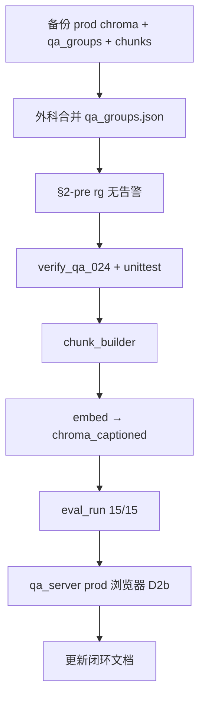

# AD5S prod 切换计划（外科 overlay · 非全库 schema 迁移）

**日期**：2026-07-03  
**状态**：**AD5S 混合 prod 切换收尾完成 ✅**（阶段 1+2 overlay + §15 M1–M3 浏览器回归）  
**前置闭环**：[`qa_024_branch_closure.md`](./qa_024_branch_closure.md)（pilot + 浏览器 D2b ✅）  
**关联排期**：[`docs/排期.md`](../../docs/排期.md) § BL-V1-04 复杂档 · schema §9 #7

---

## 1. 背景

qa_024 复杂档（`applies_when_any`、2 branch、branch 配图、demo 筛选）已在 pilot 库 `run-ad5s-dry-ladder` 完成自动化四项 + 浏览器验收。  
prod 库 `run-ad5s/chroma_captioned` 仍为旧结构：qa_024 无 `troubleshooting_ladder`，4 张配图根挂、无 branch 筛选。

**本计划目标**：在 **不牵动未验证组** 的前提下，将已验结构化改动 **外科式** 并入 prod，并保留回滚路径。

---

## 2. 当前状态盘点

### 2.1 已闭环、可认为稳定

| 项 | 说明 |
| --- | --- |
| TC148 三库 demo | Gate #5 浏览器验收关闭，无 block 级 ❌ |
| BL-PDF-04 | parser 双命名空间 / duplicate bug，硬 gate 已过 |
| BL-V1-06 | 协商话术过滤（qa_023 验证） |
| qa_024 复杂档 pilot | 四项自动化 + 浏览器 D2b ✅（`dry-ladder:8766`） |

### 2.2 在 backlog、本次 prod 切换 **不夹带**

| 项 | 说明 |
| --- | --- |
| BL-V1-04 简单档 | TC148 已合入；AD5S qa_003/010 白名单未推进 |
| BL-V1-04 复杂档 | 除 qa_024 外，qa_023 等同 pipeline 未做 |
| BL-V1-05 | ZH/EN 非互译（TC148 结构性 + AD5S 细节异构），仅定性记录 |
| BL-EXT-01 | extract 缺口（§十九保养、URL 21→8） |
| D2 / §十四 | `demo_qa_log` **⚠️re-review**；qa_022 等未修复 |
| `generate_answer` | 未结构化消费 ladder/branch |

### 2.3 D2 判级修正（记录原则）

原「✅ 无数值失真」已收回为 **⚠️re-review**：当时只验证了「当次展示数值未被篡改」，**未**验证 50Ω/1152 公式入库、协商话术过滤、US/UK 条件链归位。后续进展不顺手美化早前结论。

---

## 3. 技术约束

`embed_ingest_local.py` **无增量更新**：每次入库 = `delete_collection` + 全量 re-embed + 重写 `manifest.json`。

因此「只切 qa_024」在工程上指：

1. 在 **`qa_groups.json` 层** 仅替换目标组的结构化记录；
2. 其余 **25 组保持 prod 现状**（旧 extract、无 ladder、无 links[]）；
3. 对 **全库 27 组** 再跑 `chunk_builder` → `embed_ingest_local`（向量数不变，约 52 条）。

demo 通过 `manifest.json` 中的 `troubleshooting_ladder` 决定是否展示 ladder UI；**未改动的组行为与现 prod 一致**。

> **25 组 flat = interim，非终态**；本批止于 qa_024 + qa_008，下一批见 **§14**。

---

## 4. 范围方案对比

| 方案 | 做法 | 未验证部分后果 | 建议 |
| --- | --- | --- | --- |
| **A · 外科 overlay（推荐）** | prod `qa_groups.json` 为底，**只替换**已验组（见 §5）→ chunk → re-embed | 其余 25 组结构不变 | **采用** |
| **B · 全量 re-extract 27 组** | 新跑 `qa_doc_extractor` 全库 → chunk → re-embed | 约 **11 组** 自动 `attach_troubleshooting_ladder`（prod 现为 **0**）；**全组** BL-V1-06 协商剥离；链接仍 ~8 条 — **非丢失，是展示/正文行为变** | **不做**（另开 PR） |
| **C · 双轨维持** | prod `:8765` 不动；复杂档继续 pilot `:8766` | 无风险；qa_024 不进默认 demo 库 | 过渡可接受 |

**整库切换时「未覆盖内容」澄清**（方案 B）：不会丢组或丢 chunk；但会静默改变多组 ladder 展示、协商句正文、qa_024 配图逻辑等 — **大部分无浏览器验收**。

---

## 5. overlay 范围（已拍板：分两阶段）

| 阶段 | 替换组 | 验收依据 | 状态 |
| --- | --- | --- | --- |
| **阶段 1** | 仅 `qa_024` ← `run-ad5s-dry-ladder/qa_groups.json` | 四项脚本 + D2b 浏览器 ✅ | **prod 已切换 ✅ 2026-07-03** |
| **阶段 2** | overlay `qa_008`（ladder 4 步、`is_last_resort` 末环） | 单元测试 + eval a08 + probe | **prod 已切换 ✅ 2026-07-03** · 浏览器待签 |

**为何分两阶段**：qa_024 证据链完整；qa_008 仅有 ladder 层抽查，不必与 qa_024 绑在同一刀。每阶段仍走同一套外科 overlay（prod 为底、只换目标组 → chunk → re-embed），**不**做全库 re-extract。

**阶段 2 追加门禁**：见 §6.2（`test_qa_008`、浏览器四步 + 末环、eval 15/15 不退化）。

---

## 6. 执行门禁（切换前 · 切换后）

### 6.1 通用（不论 1 组或 2 组）

**切换前**

```powershell
cd d:\pythonProject\manual-kb

# 1. 备份 prod（回滚用）
Copy-Item -Recurse _scratch/run-ad5s/chroma_captioned _scratch/run-ad5s/chroma_captioned.bak-20260703
Copy-Item _scratch/run-ad5s/qa_groups.json _scratch/run-ad5s/qa_groups.json.bak-20260703
Copy-Item _scratch/run-ad5s/chunks_captioned.json _scratch/run-ad5s/chunks_captioned.json.bak-20260703

# 2. 外科合并 qa_groups.json（脚本或手工：prod 为底，按 §5 替换 group 记录）
#    产出：_scratch/run-ad5s/qa_groups_merged.json → 覆写或校验后替换 qa_groups.json

# 3. §2-pre
rg "structure_warnings" _scratch/run-ad5s/qa_groups.json
rg "stall_branch_align_failed" _scratch/run-ad5s/qa_groups.json
# 期望：无匹配

# 4. 自动化验收（路径指向 merged/prod qa_groups 或 dry-ladder 源）
python -m unittest tests.test_branch_utils -v
python _scratch/eval/verify_qa_024_acceptance.py

# 5. chunk + embed
python chunk_builder.py _scratch/run-ad5s/qa_groups.json _scratch/run-ad5s/chunks_out
# caption 流水线若不变更图片，可复用现有 chunks_captioned 路径策略 — 见 §7
python embed_ingest_local.py _scratch/run-ad5s/chunks_captioned.json _scratch/run-ad5s/chroma_captioned --model _scratch/modelscope/BAAI/bge-m3

# 6. 检索回归
python eval_run.py _scratch/run-ad5s/chroma_captioned --eval eval_queries_ad5s.json
# 期望：15/15（或记录不退化 delta）
```

**切换后 · 浏览器**

| ID | Query | 库 | 通过标准 |
| --- | --- | --- | --- |
| D2b | 走停加电阻 二极管怎么接 | prod `:8765` | Top1 qa_024；筛选 推开门·关门不正常·美国 → 1 卡、⇄、+Motor、026+028 |
| （若含 qa_008） | 遥控距离太短 站远点就不行 | prod `:8765` | Top1 qa_008；ladder 4 步；步骤 4「若以上均无效」/ERM12 |

**切换后 · 记录**

- 更新 [`qa_024_branch_closure.md`](./qa_024_branch_closure.md) 状态（prod 已切换）
- [`demo_qa_log.md`](./demo_qa_log.md) 注明 D2b 在 **prod 端口** 复测
- [`docs/排期.md`](../../docs/排期.md) § BL-V1-04 / schema §9 #7

### 6.2 仅当 overlay 含 qa_008 时追加

- [ ] `tests.test_ladder_utils` · `test_qa_008_from_dry_run_json` 对 merged json 仍绿
- [ ] 浏览器 ladder 四步 + `is_last_resort` 末环
- [ ] `eval_queries_ad5s.json` **a08** Top1 仍为 qa_008

---

## 7. 流水线步骤（拍板后执行顺序）



**chunk / caption 说明**：

- 若仅改 qa_024（+可选 qa_008）的 `qa_groups.json`，需从 merged json **重跑 chunk_builder**，再与现有 caption 策略对齐（图片 basename 未变则可复用 `run-ad5s/images`）。
- **不要**在此步骤顺带全库 re-extract（避免方案 B 副作用）。

---

## 8. 明确不做（本计划边界）

| 不做 | 原因 |
| --- | --- |
| 27 组全量 re-extract 当 prod 切换 | 11 组自动 ladder + 全组协商过滤，未验收 |
| qa_023 复杂档一并切 | 未走 qa_024 同级 pipeline |
| BL-EXT-01 URL/保养组 | 独立 backlog |
| BL-V1-05 ZH/EN 合并 | 独立 backlog |
| D2 / qa_022 §十四修复 | re-review，独立修复项 |
| 三库 merge（BL-RET-01a） | Gate #5 已结论：分库 demo 通过 |

---

## 9. 回滚

```powershell
# 若 prod 切换后验收失败
Remove-Item -Recurse -Force _scratch/run-ad5s/chroma_captioned
Copy-Item -Recurse _scratch/run-ad5s/chroma_captioned.bak-20260703 _scratch/run-ad5s/chroma_captioned
Copy-Item _scratch/run-ad5s/qa_groups.json.bak-20260703 _scratch/run-ad5s/qa_groups.json
Copy-Item _scratch/run-ad5s/chunks_captioned.json.bak-20260703 _scratch/run-ad5s/chunks_captioned.json
```

pilot `run-ad5s-dry-ladder:8766` 在回滚期间仍可作 qa_024 演示备用。

---

## 10. 决策记录

| # | 决策项 | 结论 |
| --- | --- | --- |
| 1 | overlay 策略 | **分两阶段**：先 qa_024，后 qa_008 |
| 2 | 阶段 1 | **已完成** — eval **15/15** · probe Top1 qa_024 · ladder 2 branch · 脚本 PASS |
| 3 | 阶段 1 浏览器 | **已完成**（prod `:8765` 无筛选 + **有筛选** D2b ✅） |
| 4 | 阶段 2 | **已完成** — eval **15/15** · **浏览器 A8 ✅** 0.7731 |
| 5 | 回滚备份 | phase1 `*.bak-20260703-phase1` · phase2 `*.bak-20260703-phase2` |

---

## 11. 相关文档

- [`ad5s_complex_ladder_round_closure.md`](./ad5s_complex_ladder_round_closure.md) — **本轮收尾全貌**（独立查阅 · 2026-07-05 关闭）
- [`qa_024_branch_closure.md`](./qa_024_branch_closure.md) — pilot 验收与数据结构
- [`demo_checklist.md`](./demo_checklist.md) §2-pre、D2b
- [`troubleshooting_schema_v1.md`](./troubleshooting_schema_v1.md) §9 实现状态
- [`docs/排期.md`](../../docs/排期.md) — BL-V1-04 / Gate #5 总表

---

## 12. 阶段 1 执行记录（2026-07-03）

| 步骤 | 产出 | 结果 |
| --- | --- | --- |
| 备份 | `*.bak-20260703-phase1` | ✅ |
| 外科合并 | `run-ad5s/qa_groups.json`（仅 qa_024 替换） | ✅ |
| §2-pre | 无 `stall_branch_align_failed` | ✅ |
| 验收 | `verify_qa_024` + `test_branch_utils` 9/9 | PASS |
| chunk | `chunks_out/chunks.json` + `chunks_captioned.json`（保留 qa_024 图 caption） | ✅ |
| embed | `chroma_captioned` 52 vectors | ✅ |
| eval | `eval_queries_ad5s.json` | **15/15** |
| probe | `走停加电阻 二极管怎么接` → qa_024 · 2 branch · US 026+028 | ✅ |

**脚本**：[`phase1_overlay_qa024.py`](./phase1_overlay_qa024.py)（`backup` / `merge-groups` / `merge-chunks`）

**prod demo 启动**（默认库已含 qa_024 新结构）：

```powershell
python qa_server.py --chroma-dir _scratch/run-ad5s/chroma_captioned `
  --images-dir _scratch/run-ad5s/images --port 8765
```

**待办**：~~浏览器 D2b~~ **已完成**（见 §13 · demo_qa_log D2b-prod / A8-prod）。

---

## 13. 阶段 2 执行记录（2026-07-03）

| 步骤 | 产出 | 结果 |
| --- | --- | --- |
| 备份 | `*.bak-20260703-phase2`（含阶段 1 后 prod） | ✅ |
| 外科合并 | `qa_groups.json` 仅替换 **qa_008**（保留 qa_024） | ✅ ladder 4 步 |
| chunk 合并 | `qa_008_c001` + 保留 caption `embedding_text` | ✅ `is_last_resort=True` |
| embed | `chroma_captioned` 52 vectors | ✅ |
| eval | `eval_queries_ad5s.json` | **15/15**（**a08** → qa_008） |
| probe | `遥控距离太短 站远点就不行` | Top1 **qa_008** 0.77 · ladder 4 · ERM12 |
| 浏览器 | 同上 query · prod `:8765` | **✅** 0.7731 · 4 步 · 步骤4「若以上均无效」· 005+006 |

**脚本**：[`phase2_overlay_qa008.py`](./phase2_overlay_qa008.py)

---

## 14. 定性：25 组 = interim，不是终态

本次 prod 切换（阶段 1 qa_024 + 阶段 2 qa_008）**不是** AD5S 库的最终形态，而是 **interim 混合态**：

| 维度 | 现状 | 说明 |
| --- | --- | --- |
| **已切 ladder** | **2 组**（qa_024、qa_008） | 经 pilot / 四项脚本 / 浏览器签字 |
| **仍为旧 flat** | **25 组** | 保持 overlay 前 prod extract；demo 走 `hasLadder` 回退，行为应与旧 prod 一致 |
| **本批截止** | qa_024 + qa_008 | **不在此 switch 内**继续扩切 |

**下一批优先级**（与 [`docs/排期.md`](../../docs/排期.md) 对齐，单独开批、独立验收）：

1. **BL-EXT-01** — extract 缺口（URL 21→8、§十九保养等）
2. **BL-V1-04 简单档** — qa_003 / qa_010 链接
3. **qa_023** — 复杂档（同 qa_024 管线：pilot → 四项 → overlay）

**潜在 auto-ladder 组**（全量 re-extract 约 11 组会静默 `attach_troubleshooting_ladder`）：**不批量切**；须按组 pilot + 浏览器验收后再外科 overlay（见 §4 方案 B）。

> 单独翻阅本文档时：勿将「25 组 flat + 2 组 ladder」误读为终态；完整路线图见排期与 backlog 表（§8）。

---

## 15. 混合 prod 收尾（旧组浏览器回归）

overlay 后 prod 为 **混合态**（§14）。Gate #5 的 D1/D3/D4 浏览器记录为 **overlay 之前** 的旧 prod，**不能**作为混合态签字依据。

| ID | query | 预期 top1 | 覆盖点 |
| --- | --- | --- | --- |
| **M1** | 按遥控器完全没反应 | qa_010 | flat + 配图 |
| **M2** | 控制板一直咔哒响 | qa_011 | flat、无 branch 筛选器 |
| **M3** | 一按遥控保险丝就烧 | qa_012 | 长组子块命中 → parent 配图/链接 |

**通过标准**：无 JS 报错；`ladderWrap` / `branchFilterWrap` 保持 hidden；`answer` 展示 flat 步骤；配图/链接位置未错位。

记录见 [`demo_qa_log.md`](./demo_qa_log.md) · **M1–M3-prod** 行。

**结果（2026-07-05）**：Playwright headless · prod `:8765` · **3/3 PASS · 无 JS 报错**。

| ID | top1 | score | flat UI | 配图 |
| --- | --- | ---: | --- | --- |
| M1 | qa_010 | 0.7746 | ✅ hidden ladder/filter | image_007×1 |
| M2 | qa_011 | 0.8399 | ✅ | 无 |
| M3 | qa_012 | 0.8118 | ✅ | 无 |
